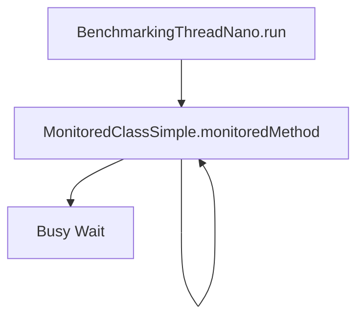
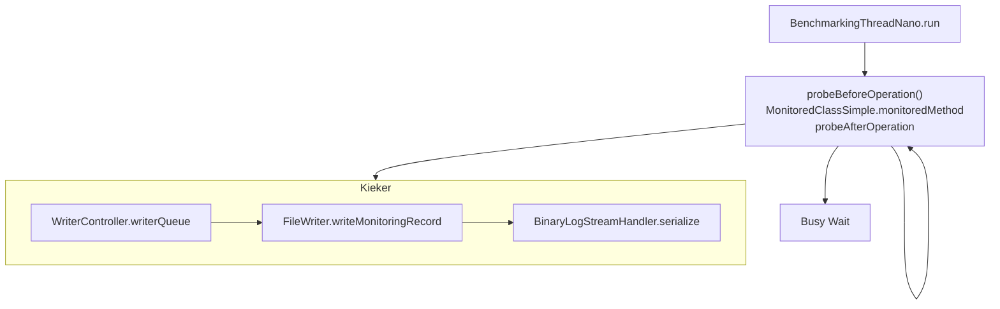

# The MooBench Observability Overhead Micro-Benchmark 

The MooBench micro-benchmarks can be used to quantify the performance overhead caused by observability framework components and different observability frameworks. Observability is achieved through its three pillars:
* Logs, i.e., timestamped information about system events,
* Metrics, i.e., numerical measurements of system behaviour, and
* Traces, i.e., representations of request, transaction or operation executions.

MooBench can measure the overhead that is created by obtaining any of these three pillars of observability from program execution. 

Continuous measurement results are available here:
* Kiel University Server (Intel Xeon CPU E5620 @ 2.40 GHz, Debian 12): https://kieker-monitoring.net/performance-benchmarks/
* GH Actions Runner (Ubuntu 24.04 -- see `.github/workflows/benchmark*.yaml` for curent version): https://kieker-monitoring.github.io/moobench-data/dev/bench/

Currenly (fully) supported observability frameworks are:
* Elastic APM with Java (https://github.com/elastic/apm-agent-java)
* inspectIT with Java (https://inspectit.rocks/)
* Kieker with Java (http://kieker-monitoring.net)
* OpenTelemetry with Java (https://opentelemetry.io/)
* PinPoint with Java (https://github.com/pinpoint-apm/pinpoint)
* Scouter with Java (https://github.com/scouter-project/scouter)

For all combinations of supported observability frameworks $FRAMEWORK and languages $LANGUAGE, the folder `frameworks` contains a folder $FRAMEWORK-$LANGUAGE.

## Approach

MooBenchs measures the overhead of gathering observability data by executing an example workload using different configurations, including *no instrumentation* (and hence no data gathering) at all, full distributed tracing and data serialization via *binary writer*. The example workload consists of `$RECURSION_DEPTH` recursive calls of a function to itself. For example, the following graph shows the execution of MooBench in the *no instrumentation* configuration:



The *binary writer* configuration on the other hand includes the probe code, that is injected by the observability tool before and after the operation. For the Kieker monitoring framework, the probe inserts records into the `WriterController.writerQueue`, and these are then processed for finally writing binary data to the hard disk.



## Benchmark Execution

### Prerequisites

To use MooBench, please make sure the following tools are installed:
- A linux system, capable of running bash 5.x (or newer), including `curl` and `awk` (`sudo dnf install gawk curl`)
- A recent R installation (Rocky Linux: `sudo dnf install epel-release; sudo dnf config-manager --set-enabled crb; sudo dnf install R`)
- For Pinpoint and Skywalking: Docker 28.0.0 or newer (for containers that manage observability data persistence)
- For Java agents (Kieker, OpenTelemetry, Pinpoint, inspectIT, Skywalking)
    * A recent JDK installation (OpenJDK 17 or newer); `$JAVA_HOME` needs to be set
- For Python agents (Kieker, OpenTelemetry)
    * Python 3.11 or newer

### Benchmark Execution

Compile the application and install it in the repository root directory. This can be done automatically be calling `./setup.sh`. Afterwards, you can switch to the benchmark folder (`frameworks` and then `$AGENT-$TECHNOLOGY`, e.g., OpenTelemetry as observability agent in Java) and run `./benchmark.sh`.

For example, a simple benchmark execution is:
```
./setup.sh
cd frameworks/OpenTelemetry-java/
./benchmark.sh
```

All experiments are started with the provided "External Controller" scripts.
The following scripts are available for every supported framework ($FRAMEWORK) and language ($LANGUAGE):
* In `frameworks/$FRAMEWORK-$LANGUAGE/benchmark.sh` a script is provided for regular
  execution (with default parameters)
* In `frameworks/$FRAMEWORK-$LANGUAGE/runExponentialSizes.sh` a script is provided for
  execution with different call tree depth sizes (exponentially growing from 2)

Each scripts will start different factorial experiments (started `$NUM_OF_LOOPS`
times for repeatability), which will be:
- baseline execution
- execution with instrumentation but without processing or serialization
- execution with serialization to hard disc (currently not available for
  inspectIT)
- execution with serialization to tcp receiver, which might be a simple receiver
  (Kieker), or Zikpin and Prometheus (OpenTelemetry and inspectIT)

All scripts have been tested on Ubuntu, Rocky 9.6 and Raspbian. 

The execution may be parameterized by the following environment variables:
* `SLEEP_TIME`           between executions (default 30 seconds)
* `NUM_OF_LOOPS`         number of repetitions (default 10)
* `THREADS`              concurrent benchmarking threads (default 1)
* `RECURSION_DEPTH`      recursion up to this depth (default 10)
* `TOTAL_NUM_OF_CALLS`   the duration of the benchmark (deafult 2,000,000 calls)
* `METHOD_TIME`          the time per monitored call (default 0 ns or 500 us)

If they are unset, the values are set via `frameworks/common-function.sh`.


## Formatting

All shell files should be formatted using `shfmt -w -i 2 -sr -kp`.

## Data Analysis

Each benchmark execution calls an R script providing mean, standard deviation
and confidence intervals for the benchmark variants. If you want to get these
values again, switch to `frameworks` and call `runR.sh $FRAMEWORK`, where
framework is the folder name of the framework (e.g. Kieker).

If you got data from a run with exponential growing call tree depth, unzip them
first (`for file in *.zip; do unzip $file; done`), copy all `results-$framework`
folder to a common folder and run `./getExponential.sh` in analysis. This will
create a graph for each framework and an overview graph for external processing
of the traces (zipkin for OpenTelemetry and inspectIT, TCP for Kieker).

In the folder /bin/r are some R scripts provided to generate graphs to visualize
the results. In the top the files, one can configure the required paths and the
configuration used to analyze the data.

## Quality Control

We also use MooBench as a performance regression test which is run periodically
when new features are added to Kieker.

